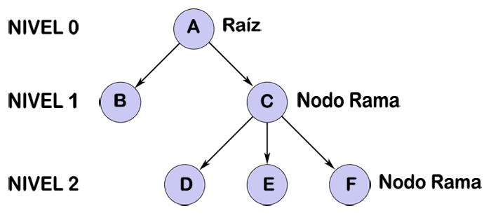

## ¿Qué es un árbol Binario?

Un **árbol binario** es una estructura de datos **no lineal** compuesta por un conjunto de **nodos** conectados mediante **ramas**.  
Dentro del árbol existe un nodo principal llamado **raíz**, a partir del cual se originan los demás nodos.

Los nodos que generan nuevas ramas se conocen como **nodos internos** o **nodos de bifurcación**, mientras que los nodos que no tienen descendientes se denominan **nodos hoja**.

En la siguiente imagen se puede observar la estructura general de un árbol binario:

## ¿Cómo se implementó?

El proyecto fue desarrollado en **Java** utilizando la biblioteca **Swing** para la creación de la interfaz gráfica.  
Su propósito es **visualizar y gestionar un árbol binario de búsqueda (Binary Search Tree)** de forma interactiva.

### Estructura general
- Se definió una **clase `Node`**, que representa cada nodo del árbol, almacenando un valor entero y referencias a sus nodos izquierdo y derecho.
- La **clase `BinaryTree`** contiene la lógica del árbol binario, incluyendo:
    - El método `insert(int value)` para agregar nuevos valores de forma recursiva.
    - El método `search(int value)` para verificar si un valor existe en el árbol.

### Interfaz gráfica (Swing)
- La ventana principal extiende de `JFrame` y contiene:
    - Un **panel superior (`JPanel`)** con un campo de texto y botones para insertar o buscar números.
    - Un **panel central (`TreePanel`)** que se encarga de **dibujar gráficamente el árbol**.

### Visualización del árbol
- La clase `TreePanel` hereda de `JPanel` y sobrescribe el método `paintComponent(Graphics g)` para dibujar el árbol recursivamente:
    - Cada nodo se representa como un círculo azul con el valor centrado.
    - Las ramas se dibujan como líneas entre nodos.
    - Se utiliza un espaciado horizontal progresivo para mantener la estructura visual clara.

### Interacción del usuario
- Al presionar el botón **“Insertar”**, el valor ingresado se añade al árbol y se redibuja automáticamente.
- Al presionar **“Buscar”**, se muestra un mensaje indicando si el valor se encuentra o no en el árbol.

### Tecnologías utilizadas
- **Lenguaje:** Java
- **Bibliotecas:** Swing y AWT
- **Características:** interfaz visual, dibujo recursivo y manejo de eventos.

## Contribuyentes

Este trabajo fue desarrollado por el grupo:

- Jhon Eduard Campo – [@Jhon](https://github.com/Jhoncampo)
- Luisa Fernanda Gaviria – [@Luisa](https://github.com/luisagaviriazapata-ai)
- Anderson David Mejia – [@Ander](https://github.com/ander8824425-boop)
